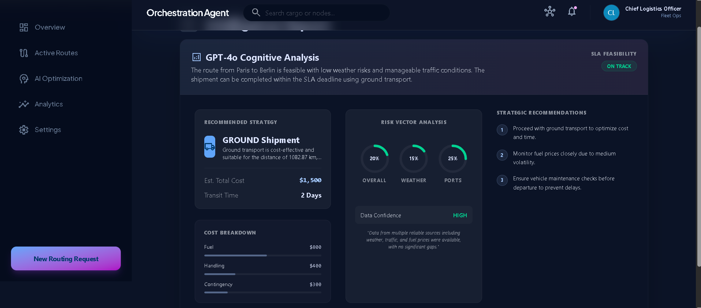

# Intelligent Shipment Orchestration Agent

An AI agent that dynamically selects optimal shipment routes (air, sea, road) based on constraints such as cost, service-level agreements (SLA), and external conditions. This full-stack application utilizes artificial intelligence for both processing raw user requirements and determining optimal logistical routing.

## 🚀 Features Implemented So Far

### 1. Robust Full-Stack Architecture
*   **Frontend**: Built with **React** (using Vite) and **TypeScript**, styled utilizing **Tailwind CSS v4** to present a dark-mode, premium visual aesthetic.
*   **Backend**: High-performance **FastAPI** (Python) server handling data routing, AI tool integrations, and logical data persistence.
*   **Database Integration**: Secure connection to **MongoDB Atlas**, handling persistence via `pymongo`. Stores active routes logic securely and manages database connections globally.

### 2. AI-Powered Natural Language Processing (NLP)
*   **Smart Routing Requests**: Users can type complex, unstructured text (e.g., *"Need to move 500kg of medical supplies from New York to London by Friday under $5000"*).
*   **Automatic Extraction**: The backend leverages OpenAI algorithms to parse the text and automatically pre-fill precise origin, destination, weight, deadline, and budget forms.

### 3. Intelligent Route Optimization Engine
*   **Pathfinding & Routing Logistics**: An AI optimization model that evaluates multi-modal routes (Air, Sea, Road) ensuring SLA compliance, budget limitations, and time deadlines.
*   **Interactive Visualization**: Dedicated **Optimization Dashboard** that reveals the breakdown of route timings, estimated transit costs, distances, and modes step-by-step.

### 4. Interactive and Premium User Interface
*   **Dashboard Layout**: Persistent global navigations avoiding layout shifts or component dismounts during route changes. 
*   **Tracked Active Routes**: An aesthetic data-table pulling live 'active' shipment statuses dynamically routed straight from the database.

### 5. Production-Grade Configuration
*   **Backend Middleware**: Configured `CORS` rules allowing modular API deployment. Set up robust Request IDs and Global Exception Handlers logging full stack traces cleanly.
*   **Secure Authentication Boilerplate**: Configured routing schemas, `bcrypt` password hashing, and user authentication infrastructure scaling.

## 🛠️ Tech Stack

**Frontend Framework**
*   [React](https://react.dev/) + [Vite](https://vitejs.dev/)
*   [TypeScript](https://www.typescriptlang.org/)
*   [Tailwind CSS (v4)](https://tailwindcss.com/)
*   [React Router v7](https://reactrouter.com/)

**Backend & Data Ecosystem**
*   [FastAPI](https://fastapi.tiangolo.com/) (Python)
*   [Uvicorn](https://www.uvicorn.org/) ASGI Server
*   [PyMongo](https://pymongo.readthedocs.io/) & MongoDB Atlas
*   OpenAI SDK 

## ⚙️ How to Run Locally

### 1. Start the Backend:
```bash
cd backend
python -m venv venv
# Windows: venv\Scripts\activate | Mac/Linux: source venv/bin/activate
pip install -r requirements.txt
uvicorn app.main:app --reload --port 8000
```
*(Ensure `.env` containing your `MONGO_URI` and `OPENAI_API_KEY` is present)*

### 2. Start the Frontend:
```bash
cd frontend
npm install
npm run dev
```

